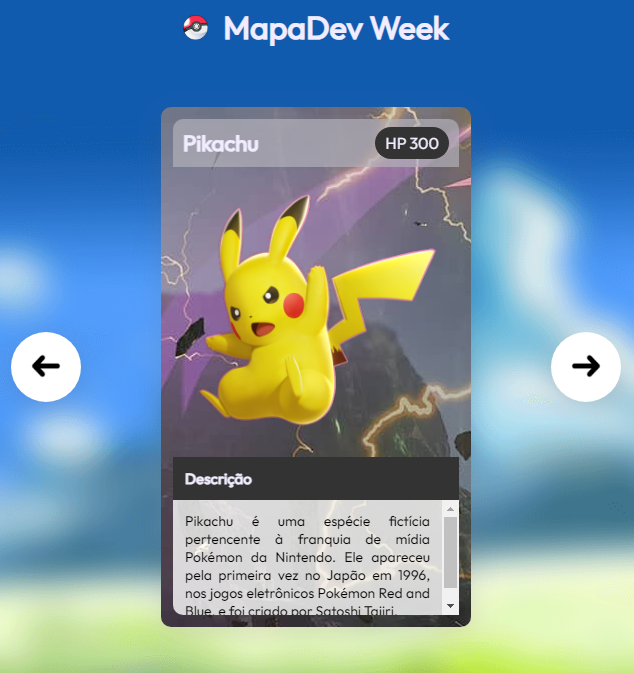
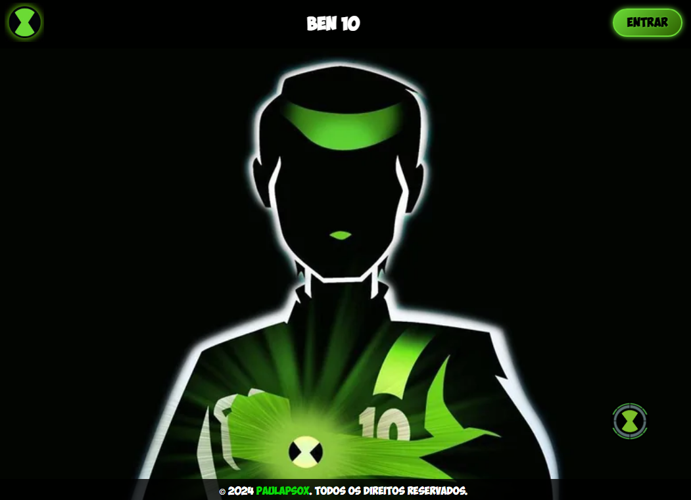
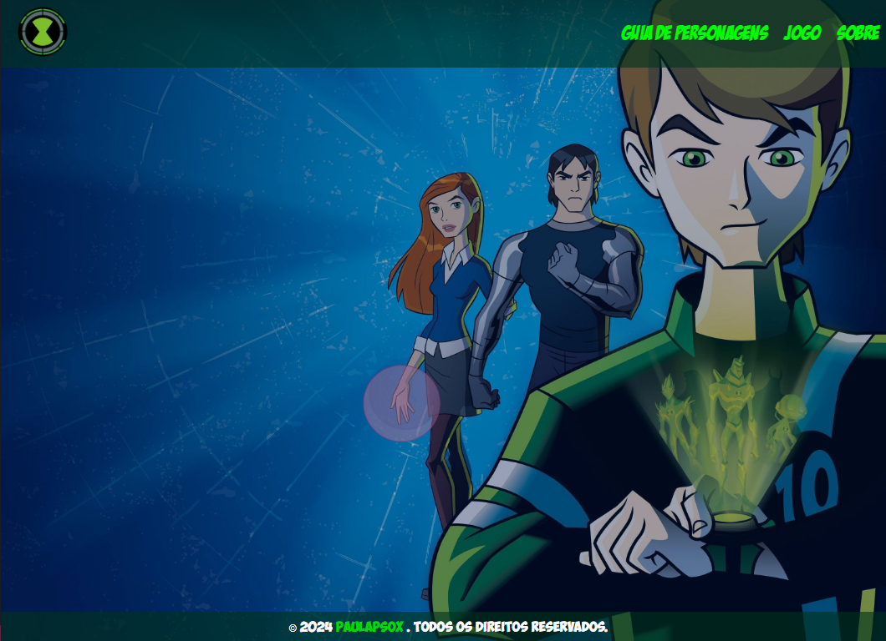
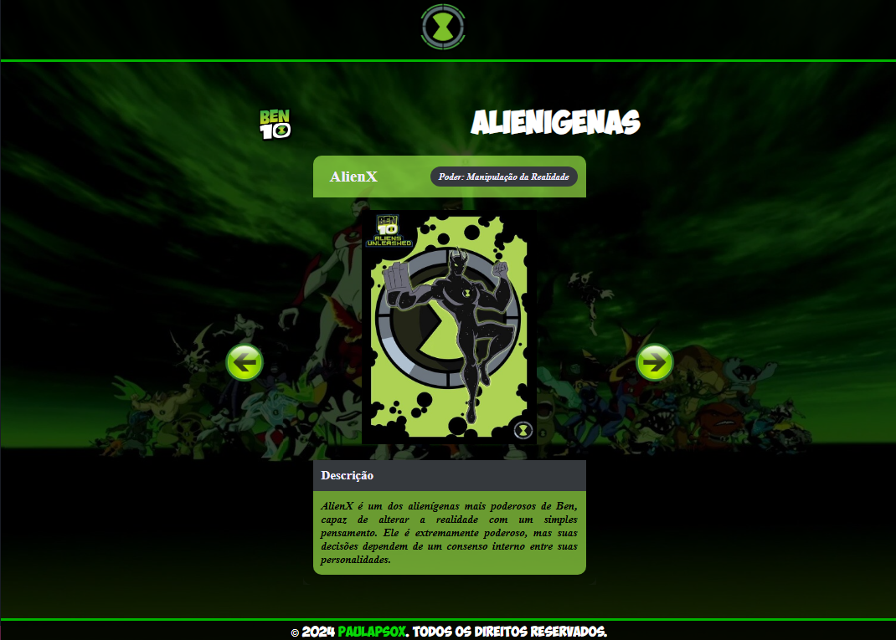
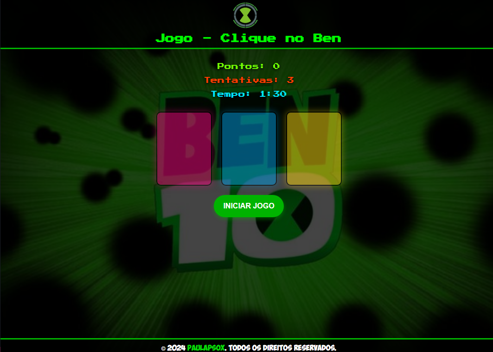
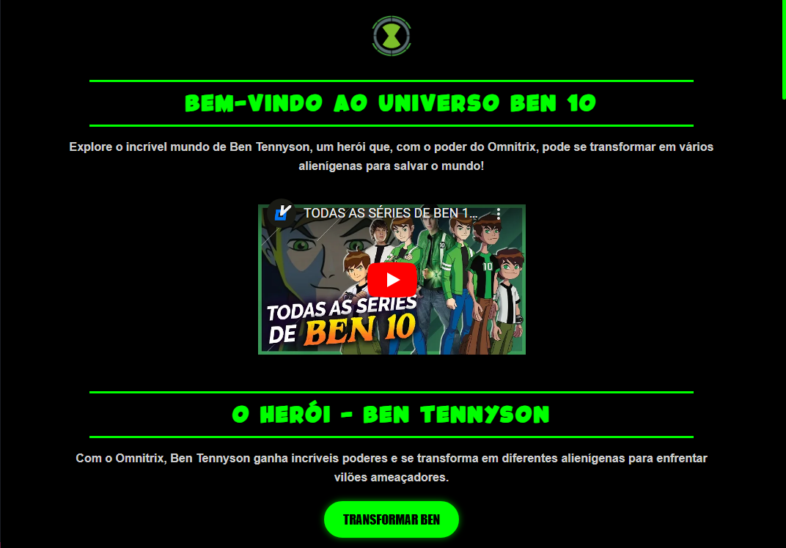

# Ben 10 - Seleção de Cards de Alienígenas 👦⌚💥👽

Este projeto é uma recriação do universo **Ben 10**, inspirado nos incríveis alienígenas e nas aventuras de Ben Tennyson. Desenvolvido com **HTML** 🧱, **CSS** 🎨 e **JavaScript** ⚙️, ele traz à vida algumas das transformações e elementos visuais que definem essa série icônica. Este projeto faz parte do desafio da comunidade **[@Dev Em Dobro](https://github.com/devemdobro)** e da **Guild Dev Em Dobro** , na semana da **Mapa Dev Week**.

---

## 🗂️ Índice

- [🎯 Objetivo do Projeto](#🎯-objetivo-do-projeto)
- [🛠️ Tecnologias Utilizadas](#🛠️-tecnologias-utilizadas)
- [📂 Estrutura do Projeto](#📂-estrutura-do-projeto)
- [📄 Descrição dos Arquivos](#📄-descrição-dos-arquivos)
- [🌟 Funcionalidades](#🌟-funcionalidades)
- [🎨 Capturas de Tela](#🎨-capturas-de-tela)
- [🚀 Como Usar](#🚀-como-usar)
- [🌐 Links Úteis](#🌐-links-úteis)
- [🔍 Testes](#🔍-testes)
- [🤝 Contribuição](#🤝-contribuição)
- [📜 Licença](#📜-licença)
- [🙏 Agradecimentos](#🙏-agradecimentos)
- [🚧 Melhorias Futuras](#🚧-melhorias-futuras)

---

## 🎯 Objetivo do Projeto

Reviver a emoção do universo **Ben 10**, oferecendo uma maneira interativa de explorar e transformar-se nos diferentes alienígenas que Ben Tennyson encontra em suas aventuras.

---

## 🛠️ Tecnologias Utilizadas

- **HTML** 🧱: Estrutura o conteúdo do projeto.  
- **CSS** 🎨: Responsável pela estilização e apresentação visual.  
- **JavaScript** ⚙️: Adiciona interatividade e funcionalidades dinâmicas.  

---

## 📂 Estrutura do Projeto

```
├── src
│   ├── css
│   ├── fonts
│   ├── imagens
│   ├── js
│   └── sounds
├── html
└── README.md
```

> 🌟 **Dica**: Confira a seção **Descrição dos Arquivos** para mais detalhes.

---

## 📄 Descrição dos Arquivos

- **CSS** 🎨: Estiliza cada página e suas seções específicas.  
- **JavaScript** ⚙️: Gerencia a lógica interativa e animações.  
- **Imagens e Sons** 📸🎵: Adicionam imersão visual e auditiva ao projeto.  

---

## 🌟 Funcionalidades

- **Seleção de Alienígenas**: Explore alienígenas como Quatro Braços, Mutante, Eco e mais.  
- **Transformações Interativas**: Efeitos visuais e sonoros com cada transformação.  
- **Jogo Interativo**: Teste habilidades com desafios temáticos.  
- **Interface Responsiva**: Compatível com dispositivos móveis e desktops.  

---

## 🎨 Capturas de Tela

Abaixo estão algumas capturas de tela que mostram a interface vibrante de inspiração da Semana Mapa Dev Week e do meu projeto de Ben 10:













---

## 🚀 Como Usar

1. **Clone o repositório** 🖥️:  
   ```bash
   git clone https://github.com/seunome/ben10-selecao-de-alienigenas.git
   ```
2. **Navegue até o projeto** 📂:  
   ```bash
   cd ben10-selecao-de-alienigenas
   ```
3. **Abra o arquivo `index.html`** 🌐:  
   Visualize o projeto diretamente no navegador!  

---

## 🌐 Links Úteis

- 🌟 **Visualizar o Projeto**: [Ben 10 - Seleção de Alienígenas](https://paulapsox.github.io/ben-10/)  
- 📂 **Repositório no GitHub**: [paulaPSOx/ben-10](https://github.com/paulaPSOx/ben-10)  

---

## 🔍 Testes

1. **Carregamento de Arquivos** ⚡: Verifique se as páginas carregam corretamente.  
2. **Interatividade** 🎮: Explore as funcionalidades e animações.  
3. **Responsividade** 📱: Teste em diferentes dispositivos para garantir a fluidez.  

---

## 🤝 Contribuição

Contribuições são sempre bem-vindas! 💡  
1. Faça um **fork** 🍴.  
2. Crie uma nova branch (`git checkout -b feature/nova-feature`).  
3. Faça suas alterações e **commit** 🔧 (`git commit -m "Descrição da alteração"`).  
4. Envie um **pull request** 📨.  

---

## 📜 Licença

Este projeto é licenciado sob a **MIT License** 📝. Confira [LICENSE](https://github.com/paulaPSOx/ben-10/LICENSE) para detalhes.  

---

## 🙏 Agradecimentos

Agradeço à comunidade **[@Dev Em Dobro](https://github.com/devemdobro)** e à **Guild Dev Em Dobro** 🛡️ pelo apoio durante o desenvolvimento deste projeto na **Mapa Dev Week** 🗺️🚀.  

---

## 🚧 Melhorias Futuras

- 🌌 **Novos Alienígenas**: Adicionar mais opções e habilidades.  
- 🎨 **Aprimoramento Visual**: Animações e transições mais fluidas.  
- 📱 **Acessibilidade**: Melhorar a navegação em dispositivos móveis.  

---

Espero que você curta explorar o universo **Ben 10**! 👦⌚👽✨
